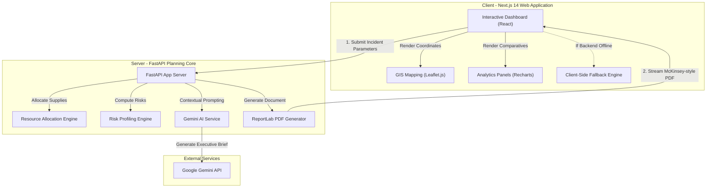

# AegisAI — Crisis Response Intelligence Platform

> **Predict. Plan. Respond.**

AegisAI is an enterprise-grade disaster intelligence platform designed for governments, NGOs, emergency management agencies, and international response coordinators. The system combines tactical asset planning, automated risk profiling, GIS mapping layouts inspired by **Palantir Gotham**, and consulting-style executive briefs matching **McKinsey Executive Analytics** standards.

---

## 🛠 Project Structure

```
aegis-ai/
├── backend/
│   ├── app/
│   │   ├── engines/
│   │   │   ├── resources.py       # Resource calculation formulas
│   │   │   └── risk.py            # Custom risk profiling engine
│   │   ├── reports/
│   │   │   └── pdf_generator.py   # ReportLab PDF compilation
│   │   ├── services/
│   │   │   └── gemini.py          # Gemini AI API with local fallbacks
│   │   ├── config.py              # Environment configuration
│   │   └── main.py                # FastAPI core app & CORS configuration
│   ├── requirements.txt
│   └── run.sh                     # Startup script
└── frontend/
    ├── src/
    │   ├── app/
    │   │   ├── layout.tsx         # Layout & SEO metadata
    │   │   ├── page.tsx           # Premium landing page
    │   │   ├── dashboard/
    │   │   │   └── page.tsx       # Crisis control panel (form, gauge, map)
    │   │   └── analytics/
    │   │       └── page.tsx       # Multi-incident comparisons (Recharts)
    │   ├── components/
    │   │   ├── Navbar.tsx         # Sleek navigation header
    │   │   ├── KPICards.tsx       # Animated metrics (Framer Motion)
    │   │   ├── MapComponent.tsx   # Interactive Leaflet map & custom pins
    │   │   └── BriefingPanel.tsx  # Tabbed strategic briefings
    │   └── lib/
    │       ├── api.ts             # API Client & local calculators fallback
    │       └── types.ts           # Shared TypeScript typings
    └── package.json
```

---

## 🏛 System Architecture

AegisAI is built with a decoupled architecture designed for high availability, consulting-grade data analysis, and advanced visual dashboards.



### 🛠 Tech Stack & Key Components

*   **Frontend Client**:
    *   **Framework**: Next.js 14 App Router with TypeScript.
    *   **Visualizations**: Recharts for comparative analytics; Leaflet.js for interactive mapping layouts inspired by **Palantir Gotham**.
    *   **Aesthetics**: Glassmorphism, animations (Framer Motion), and dark-mode CSS variables for an ultra-premium feel.
*   **FastAPI Backend**:
    *   **Core**: Python FastAPI with Pydantic for validation and CORS middleware.
    *   **LLM Orchestration**: Gemini API client utilizing dynamic context prompts to generate structured strategic briefs.
    *   **PDF Generation**: ReportLab PDF library designed to generate consulting briefs adhering to **McKinsey Executive Analytics** visual standards.
*   **Algorithmic Engines**:
    *   **Resource Allocation Engine (`resources.py`)**: Computes personnel, food kits, shelter capacities, and medical team numbers based on logarithmic population scaling and incident types.
    *   **Composite Risk Profiling Engine (`risk.py`)**: Calculates 0-100 risk indexes considering severity scales, baseline hazards, and mitigating budget variables.

### 🌟 Architectural Strengths for Recruiters

1.  **Dual-Execution Resilience (Offline Mode)**:
    If the FastAPI server is offline or the Gemini API hits rate limits, the client application gracefully transitions to local fallback algorithms. The frontend mimics the backend risk and resource logic locally, guaranteeing 100% operational readiness.
2.  **Consulting-Grade Document Compilation**:
    The PDF report utilizes custom canvas templates in ReportLab to handle running headers, signature blocks, custom leading calculations, and dynamic multi-page numbering flows (*"Page X of Y"*).
3.  **Modern Decoupled Structure**:
    Clean separation of concerns with typing definitions shared across the frontend components and unified environment variable management (`GEMINI_API_KEY`).

---

## 🚀 Running the Application

### 1. Start the Python Backend

From the project root:
```bash
cd backend
# Create virtual environment if not done:
# python3 -m venv .venv
# source .venv/bin/activate
# pip install -r requirements.txt

# Start backend uvicorn server:
./run.sh
```
The backend API documentation is available at `http://localhost:8000/docs`.

#### Environment Variables
To enable live Gemini AI generation, set the `GEMINI_API_KEY` env var:
```bash
export GEMINI_API_KEY="your-gemini-key"
```
*If no key is configured or the API is offline, AegisAI uses an internal local briefing template generator ensuring 100% operational readiness.*

---

### 2. Start the React/Next.js Frontend

From the project root:
```bash
cd frontend
# Install npm dependencies:
npm install

# Start Next.js development server:
npm run dev
```
Open `http://localhost:3003` in your web browser.

---

## 📊 Strategic Analytics & Resource Allocation Logic

### Resource Allocation Calculations
Calculated dynamically based on Affected Population ($P$) and Severity Multiplier ($S$: Low=0.25, Moderate=0.5, High=0.75, Critical=1.0):
*   **Flood:** Food kits = $P \times 1.2 \times S$, Medical teams = $P/2500 \times S$, Shelters = $P \times 0.25 \times S / 50$.
*   **Earthquake:** Food kits = $P \times 1.0 \times S$, Medical teams = $P/1000 \times S$, Shelters = $P \times 0.40 \times S / 40$, higher search/rescue budget share.
*   **Pandemic:** Medical teams = $P/500 \times S$, Isolation centers, 50% budget allocated to medical supplies/testing.
*   **Cyclone:** Food kits = $P \times 1.5 \times S$, Shelters = $P \times 0.50 \times S / 60$, high focus on wind-damage restoration.
*   **Wildfire:** Water = $P \times 25 \times S$, high focus on containment, firebreaks, and smoke inhalation gear.

### Composite Risk Scoring (0-100)
Risk scores are compiled dynamically considering:
1.  **Affected Population (30% weight):** Log-scaled, $\min(30, \text{floor}(\log_{10}(P) \times 5))$.
2.  **Severity Level (40% weight):** Low=10, Moderate=20, High=30, Critical=40.
3.  **Disaster Baseline Danger (20% weight):** Pandemics/Earthquakes=20, Cyclones=18, Wildfires=16, Floods=14.
4.  **Available Budget Offset (10% weight):** High budget per capita reduces risk index (up to -15), low budget adds risk (up to +10).

---

## 📄 PDF Generation

PDF briefs are styled to consulting presentation standards using `ReportLab` elements:
- Custom typography hierarchies and leading values.
- Styled callout block containing the high-level situation synopsis.
- Grid-aligned tables for tactical resources and budget distributions.
- Multi-page document pagination flows.
